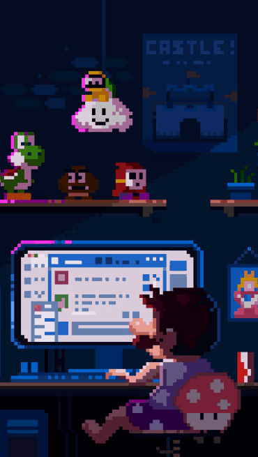

<!--
**alwyn974/alwyn974** is a ✨ _special_ ✨ repository because its `README.md` (this file) appears on your GitHub profile.

Here are some ideas to get you started:

- 🔭 I’m currently working on ...
- 🌱 I’m currently learning ...
- 👯 I’m looking to collaborate on ...
- 🤔 I’m looking for help with ...
- 💬 Ask me about ...
- 📫 How to reach me: ...é
- 😄 Pronouns: ...
- ⚡ Fun fact: ...
-->

<h1 align="center">
    
</h1>

<h2 align="center">A passionate developper from Reunion Island</h2>

<!-- yHype -->

    <a href="https://discord.com/users/249107964336537600">
        
    <a>
    
    
     
    

 

## 📝 About me

<!--  -->
<!--  -->
<!--  -->
<!--  -->

- 🇷🇪 I'm from Reunion Island
- 🔭 I’m currently working on [SkyMachi](https://github.com/SkyMachi), [StreetLess](https://github.com/StreetLess)
- 🌱 I’m currently learning **Rust**
- 💬 Ask me about **Java**, **Kotlin**, **C**, **C++**
- 📫 How to reach me: **contact@alwyn974.re**
- ⚡ Fun fact: I'm a chipmunks 🐿

 <!-- TODO: remove this -->

 ⏳ In the last 30 days 

    

