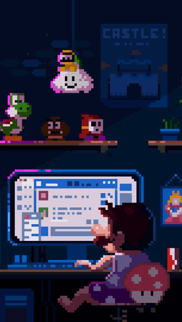

<!--
**alwyn974/alwyn974** is a ✨ _special_ ✨ repository because its `README.md` (this file) appears on your GitHub profile.

Here are some ideas to get you started:

- 🔭 I’m currently working on ...
- 🌱 I’m currently learning ...
- 👯 I’m looking to collaborate on ...
- 🤔 I’m looking for help with ...
- 💬 Ask me about ...
- 📫 How to reach me: ...
- 😄 Pronouns: ...
- ⚡ Fun fact: ...
-->

<h1 align="center">
    
</h1>

<h3 align="center">
    A passionate developper from Reunion Island 🇷🇪
</h3>

<!-- Contact  -->

<!-- Thanks to https://codepen.io/sosuke/pen/Pjoqqp for the svg trick (doesn't work on github) -->

    <a href="https://discord.com/users/alwyn974" title="My Discord">
        
        <!--  -->
    <a>
    &#8287;&#8287; <!-- special whitespace for indent -->
    <a href="https://twitter.com/alwyn974" title="My Twitter">
        
        <!--  -->
    </a>
    &#8287;&#8287;
    <a href="mailto:contact@alwyn974.re" title="My Pro E-Mail">
       
       <!--  -->
    </a>
     
    

## 📝 About me

<!--  -->
<!--  -->
<!--  -->
<!--  -->

- 🇷🇪 I'm from Reunion Island
- 🎓 I'm a **5th year student** at [Epitech](https://epitech.eu) 
- 🎓 I was an exchange student at [계명대학교 (Keimyung University)](https://www.kmu.ac.kr/) in Korea in 2023-2024
- 🔭 I’m currently working on [EnVRonment](https://github.com/StreetLess)
- 🌱 Nowadays I'm learning **Rust**
- 💬 Ask me about **Java**, **Kotlin**, **C**, **C++**, **TypeScript**, **JavaScript**, **Docker**, **NestJS**, **GitHub Actions**
- 📫 How to reach me: **contact@alwyn974.re**
- ⚡ Fun fact: I'm a chipmunks 🐿
- 👀 My Hobbies:
    - 🎮 Gaming
    - 🖥️ Programming
    - 🕵️ Cybersecurity
    - 🎞️ Movies/Series
    - 💤 Sleeping

<!-- yHype -->

## ✨ Skills & 🔨 Tools

 🛠️ Main Skills 

 

 🔧 Other Skills 

 

## 📈 Stats

 📊 My Github Stats 

 

<ul>

<li>

🔥 Streak Stats

 

<a href="https://www.github.com/alwyn974">
<picture>
  <source media="(prefers-color-scheme: light), (prefers-color-scheme: no-preference)" srcset="https://github-readme-streak-stats.herokuapp.com/?user=alwyn974&ring=0891b2&fire=0891b2&currStreakLabel=0891b2">
  
</picture>
</a>

</li>

<li>

📈 Activity Stats

 

<a href="https://www.github.com/alwyn974">
<picture>
  <source media="(prefers-color-scheme: light), (prefers-color-scheme: no-preference)" srcset="https://github-readme-stats.vercel.app/api?username=alwyn974&show_icons=true&hide=&count_private=true&title_color=0891b2&icon_color=0891b2&card_width=450px">
  
</picture>
</a>
<a href="https://www.github.com/alwyn974">
<picture>
  <source media="(prefers-color-scheme: light), (prefers-color-scheme: no-preference)" srcset="https://github-readme-stats.vercel.app/api/top-langs/?username=alwyn974&langs_count=10&title_color=0891b2&icon_color=0891b2&locale=en&layout=compact&card_width=320px">
  
</picture>
</a>
 

> **Note**
> Most Used Languages does not indicate my skill level or anything like that, it's a GitHub metric to determine which languages have the most code on GitHub.

</li>

<li>

 📊 Condensed Wakatime Stats (Last 7 days) 

 

<a href="https://wakatime.com/@alwyn974">
<picture>
  <source media="(prefers-color-scheme: light), (prefers-color-scheme: no-preference)" srcset="https://github-readme-stats.vercel.app/api/wakatime?username=alwyn974&layout=compact&title_color=0891b2&icon_color=0891b2&locale=en">
  
</picture>
</a>

> **Note**
>  Wakatime Stats does not indicate my skill level or anything like that, it's just a metric that show which languages I've spent the most time on the last 7 days.
</li>

<li>

🎀 Commit Stats 

 

<a href="https://www.github.com/alwyn974">
<picture>
  <source media="(prefers-color-scheme: light), (prefers-color-scheme: no-preference)" srcset="https://github-readme-activity-graph.vercel.app/graph?username=alwyn974&bg_color=ffffff&color=333333&line=0891b2&area_color=1c1917&area=true&hide_border=true&custom_title=GitHub%20Commits%20Graph">
  
</picture>
</a>

</li>

<li>

🏆 Github Trophies 

 

<a href="https://github.com/alwyn974">
<picture>
  <source media="(prefers-color-scheme: light), (prefers-color-scheme: no-preference)" srcset="https://github-profile-trophy.vercel.app/?username=alwyn974&column=-1&margin-w=5&margin-h=10">
  
</picture>
</a>

</li>

</ul>

 📊 My Wakatime Stats 

 

<ul>

<li>

📜 Languages 

</li>

<li>

✍️ Coding activity 

</li>

<li>

🖥️ IDEs & OS 

 

| IDEs | OS |
| --- | --- |
|  |  |

</li>

</ul>

 

  
  

